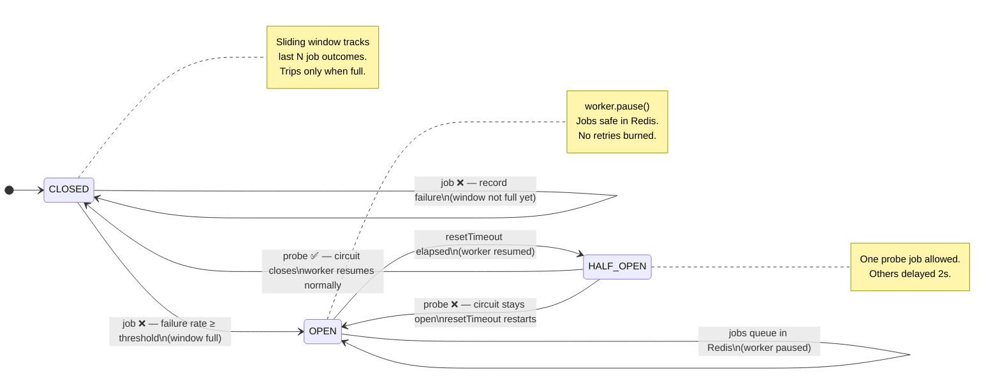

# bullmq-circuit-breaker

A Circuit Breaker wrapper for [BullMQ](https://bullmq.io) workers.

When your downstream dependency (database, external API) goes down, BullMQ keeps picking up jobs, failing them, and burning through retries — all while the downstream is still broken. This library adds a **circuit breaker** that pauses the worker when the failure rate spikes and resumes automatically once recovery is confirmed.

---

## The Problem

```
Without a circuit breaker:

  DB goes down
       │
       ▼
  Worker picks up job ──► processor throws ──► retry 1 ──► retry 2 ──► retry 3 ──► failed
  Worker picks up job ──► processor throws ──► retry 1 ──► retry 2 ──► retry 3 ──► failed
  Worker picks up job ──► processor throws ──► ...
       │
       │  (DB is still down the whole time)
       │  (you've burned 500 retries, flooded your failed set,
       │   and hammered a broken DB making recovery harder)
       ▼
  DB recovers — but your queue is a mess
```

---

## The Solution

```
With bullmq-circuit-breaker:

  DB goes down
       │
       ▼
  Job fails ──┐
  Job fails ──┤  failure rate ≥ threshold
  Job fails ──┘  across last N jobs
       │
       ▼
  ┌─────────────────────────────────────────────┐
  │  CIRCUIT OPENS                              │
  │  worker.pause() ── jobs queue up in Redis   │
  │  no retries burned, DB gets breathing room  │
  └─────────────────────────────────────────────┘
       │
       │  resetTimeout elapses (e.g. 30s)
       ▼
  ┌─────────────────────────────────────────────┐
  │  HALF-OPEN                                  │
  │  one probe job is allowed through           │
  └─────────────────────────────────────────────┘
       │                    │
    probe ✅             probe ❌
       │                    │
       ▼                    ▼
  CIRCUIT CLOSES        CIRCUIT STAYS OPEN
  worker.resume()       wait another 30s
  jobs drain normally   try again later
```

---

## State Machine



| State | Worker | Jobs | What happens |
|-------|--------|------|--------------|
| **CLOSED** | Running | Processed normally | Outcomes recorded in a sliding window. Trips to OPEN when failure rate ≥ threshold across the last `windowSize` jobs. The window must be full first — no false trips at cold start. |
| **OPEN** | Paused | Safe in Redis queue | `worker.pause()` is called. Jobs accumulate but are not consumed. A timer counts down `resetTimeout` ms before probing. |
| **HALF_OPEN** | Resumed | One probe allowed | `worker.resume()` is called. The first job acts as a probe. If it succeeds, the circuit closes. If it fails, the circuit opens again and the timer restarts. Any other jobs that arrive during probing are delayed 2s so they aren't lost. |

---

## Sliding Window

The circuit only evaluates failure rate once the window is **full** — this prevents false trips at startup when you have only 1–2 data points.

```
windowSize = 5, failureThreshold = 0.6

  Job 1: ✅  window: [✅]               rate: 0%   — window not full, no check
  Job 2: ❌  window: [✅ ❌]            rate: 50%  — window not full, no check
  Job 3: ❌  window: [✅ ❌ ❌]         rate: 67%  — window not full, no check
  Job 4: ❌  window: [✅ ❌ ❌ ❌]      rate: 75%  — window not full, no check
  Job 5: ❌  window: [✅ ❌ ❌ ❌ ❌]   rate: 80%  — FULL → 80% ≥ 60% → OPEN 🔴

  (window is circular — oldest result evicted as new ones come in)
```

---

## Install

```bash
npm install bullmq-circuit-breaker bullmq
```

---

## Usage

```typescript
import { CircuitBreakerWorker, CircuitState } from 'bullmq-circuit-breaker';
import { Queue } from 'bullmq';

const connection = { host: 'localhost', port: 6379 };

// Standard BullMQ queue — no changes needed here
const queue = new Queue('email-queue', { connection });
await queue.add('send-welcome', { to: 'user@example.com' });

// Wrap your worker with the circuit breaker
const worker = new CircuitBreakerWorker(
  'email-queue',

  // Processor — same as a normal BullMQ processor
  async (job) => {
    await sendEmail(job.data);
  },

  // Standard BullMQ WorkerOptions
  { connection, concurrency: 5 },

  // Circuit breaker config
  {
    failureThreshold: 0.5,  // trip when ≥50% of last 10 jobs fail
    windowSize: 10,
    resetTimeout: 30_000,   // wait 30s before probing
  },
);

// Listen to state changes
worker.on('stateChange', (from, to) => {
  console.log(`Circuit: ${from} → ${to}`);

  if (to === CircuitState.OPEN) {
    // notify on-call, send Slack alert, etc.
  }
});

// Check metrics anytime
console.log(worker.metrics);
// { state: 'CLOSED', failureRate: 0.2, windowFilled: 7, windowSize: 10 }

// Graceful shutdown
await worker.close();
await queue.close();
```

---

## API

### `new CircuitBreakerWorker(queueName, processor, workerOptions, breakerOptions)`

`workerOptions` is standard [BullMQ `WorkerOptions`](https://api.bullmq.io/interfaces/v5.WorkerOptions.html) — `concurrency`, `connection`, `limiter`, etc.

`breakerOptions`:

| Option | Type | Description |
|--------|------|-------------|
| `failureThreshold` | `number` (0–1) | Failure rate that trips the circuit. e.g. `0.5` = trip at ≥50% failures |
| `windowSize` | `number` | Number of recent jobs to evaluate. Circuit won't trip until this many jobs have run. |
| `resetTimeout` | `number` | Milliseconds to wait in OPEN before sending a probe job |
| `onStateChange` | `(from, to) => void` | Optional synchronous callback on every state transition |

### Instance members

```typescript
worker.state    // CircuitState.CLOSED | CircuitState.OPEN | CircuitState.HALF_OPEN

worker.metrics  // {
                //   state: CircuitState
                //   failureRate: number      // 0–1
                //   windowFilled: number     // how many results recorded so far
                //   windowSize: number       // your configured windowSize
                // }

worker.on('stateChange', (from: CircuitState, to: CircuitState) => void)

await worker.close()  // graceful shutdown — drains in-flight jobs
```

---

## Why not just use BullMQ retries?

BullMQ retries are **per-job** — each job fights independently. If your DB is down for 30 seconds and you have 500 jobs, all 500 will retry, all 500 will fail, and you've hammered a broken DB 1500+ times.

The circuit breaker is **queue-wide** — one trip stops all processing. The downstream gets breathing room. Jobs queue safely in Redis and drain in order once recovery is confirmed via the probe.

---

## License

MIT
